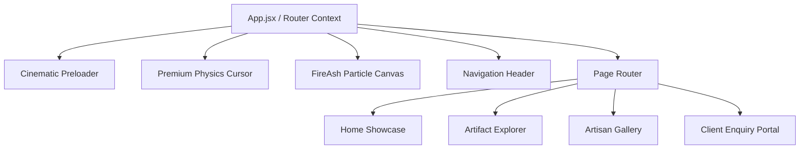

# 🗿 Niraniya Heritage — Cinematic Heritage Carvings Web Application

[](https://react.dev/)
[](https://vitejs.dev/)
[](https://www.framer.com/motion/)
[](https://reactrouter.com/)

> A cinematic, interactive web experience showcasing the timeless hand-carved stonework of **Niraniya Heritage**. Featuring custom cursor physics, fire-ash particle simulations, immersive smooth routing, and museum-grade visual showcases.

---

## ✨ Features

- **🔥 Fire & Ash Particle Canvas**: Dynamic visual particle effects simulating the sacred temple atmosphere.
- **✨ Custom Premium Cursor**: Reactive physics-based custom cursor following user interactions.
- **🎬 Cinematic Smooth Navigation**: Page transitions and section jumps orchestrated with Framer Motion and React Router 7.
- **🏛️ Product Showcases**: High-definition presentations of Granite Shiva, Marble Buddha, Obsidian Ganesha, and Sandstone Carvings.
- **📱 Fully Responsive**: Flawlessly adapts to ultra-wide desktop monitors, tablets, and smartphones.

---

## 🏗️ Architecture



---

## 🛠️ Tech Stack

- **Framework**: React 19
- **Build Tool**: Vite 8
- **Animations**: Framer Motion 12
- **Routing**: React Router 7 (`react-router-dom`, `react-router-hash-link`)
- **Icons**: Lucide React

---

## 🚀 Getting Started

```bash
# Clone the repository
git clone https://github.com/Harshxu/niraniyaheritageantigravity.git
cd niraniyaheritageantigravity

# Install dependencies
npm install

# Start development server
npm run dev
```
